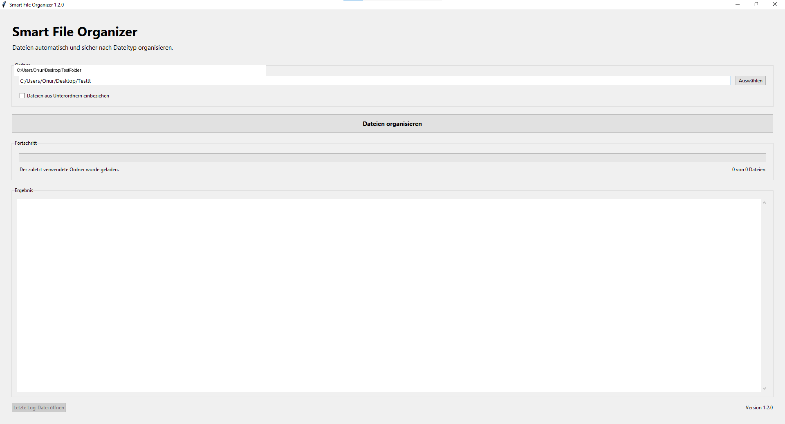
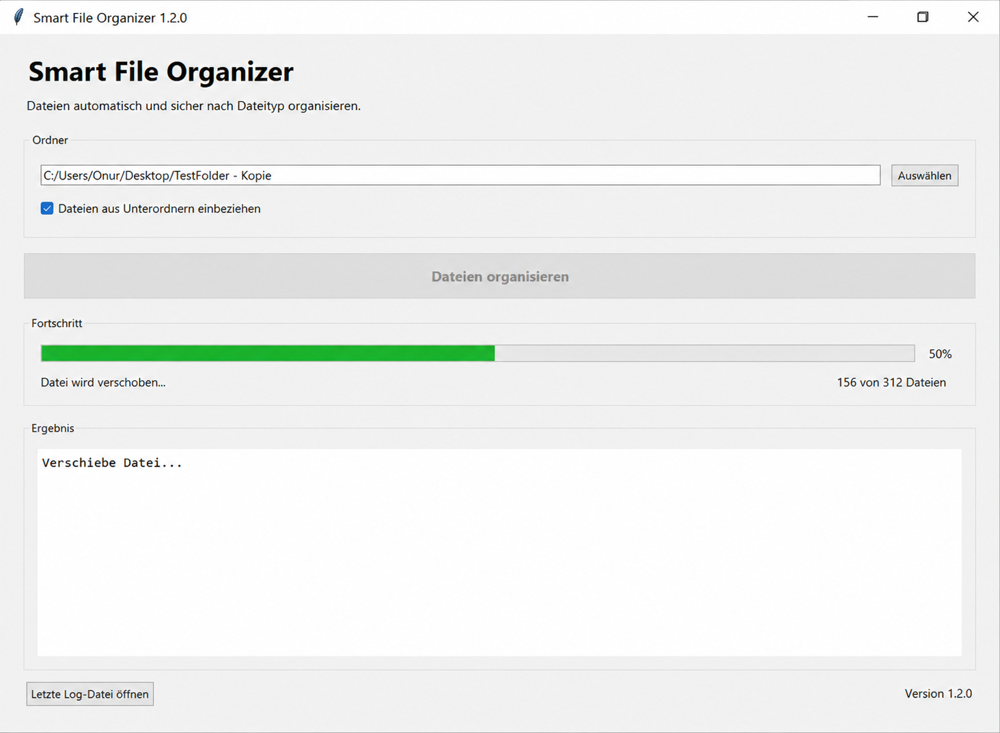
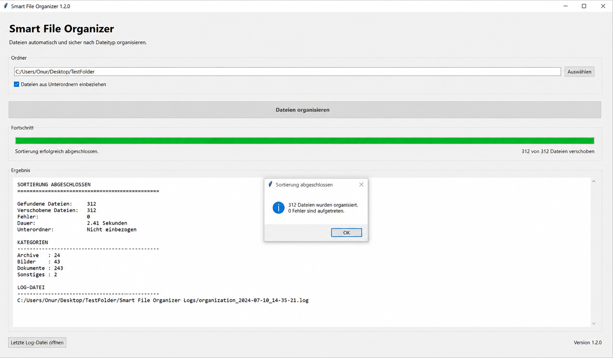

# Smart File Organizer

Smart File Organizer is a desktop application written in Python that automatically organizes files into categorized folders based on their file type.

The application provides a clean graphical user interface, detailed progress information, automatic log generation, duplicate file protection, and persistent user settings.

---

## Overview

The application scans a selected folder and sorts files into dedicated directories such as:

- Documents
- Images
- Videos
- Music
- Archives
- Source Code
- Programs
- Data & Configuration
- Disk Images
- Other

Existing files are never overwritten. If a file with the same name already exists, a new filename is generated automatically.

---

## Screenshots

### Main Window



### Organizing Files



### Result



---

## Features

- Automatic file organization
- Support for more than 70 file extensions
- Graphical user interface built with Tkinter
- Automatic category creation
- Duplicate filename protection
- Detailed progress indicator
- Processing statistics
- Log file generation
- Optional recursive folder scan
- Automatic saving of user settings
- Error handling and validation
- Fast processing using the Python standard library

---

## Installation

Clone the repository.

```bash
git clone https://github.com/onurguendogdu/smart-file-organizer.git
```

Open the project.

```bash
cd smart-file-organizer
```

Run the application.

```bash
python src/main.py
```

No third-party dependencies are required.

---

## Usage

1. Launch the application.
2. Select a folder.
3. Enable recursive scanning if required.
4. Click **"Dateien organisieren"**.
5. The application creates category folders automatically.
6. Files are moved into the correct destination folders.
7. A detailed log file is generated.

---

## Example

### Before

```
Downloads
│
├── photo.jpg
├── report.pdf
├── movie.mp4
├── archive.zip
├── music.mp3
```

### After

```
Downloads
│
├── Images
│   └── photo.jpg
│
├── Documents
│   └── report.pdf
│
├── Videos
│   └── movie.mp4
│
├── Music
│   └── music.mp3
│
└── Archives
    └── archive.zip
```

---

## Project Structure

```
smart-file-organizer
│
├── screenshots
│   ├── main-window.png
│   ├── progress.png
│   └── result.png
│
├── src
│   ├── main.py
│   ├── organizer.py
│   ├── file_utils.py
│   ├── config.py
│   └── settings.py
│
├── README.md
├── CHANGELOG.md
├── LICENSE
├── requirements.txt
└── .gitignore
```

---

## Logging

Each execution creates a detailed log file containing:

- Processing time
- Moved files
- Statistics
- Error messages
- Processing duration

The log file is stored automatically inside the processed directory.

---

## Error Handling

The application validates user input before processing.

Implemented checks include:

- Invalid folder selection
- Missing folders
- Permission errors
- Duplicate filenames
- Invalid files
- Unexpected runtime errors

Whenever possible, the application continues processing remaining files instead of terminating.

---

## Technologies

- Python 3
- Tkinter
- pathlib
- shutil
- json
- datetime

Only modules from the Python Standard Library are used.

---

## Version

Current release:

**Version 1.2.0**

Major improvements include:

- Improved graphical user interface
- Persistent application settings
- Recursive folder scanning
- Detailed logging
- Improved statistics
- Better validation
- Cleaner project structure

---

## Future Improvements

Planned improvements include:

- Drag and drop support
- Search functionality
- Additional file categories
- Dark mode
- Configuration editor

---

## License

This project is released under the MIT License.

See the `LICENSE` file for additional information.

---

## Author

**Onur Gündogdu**

GitHub:

https://github.com/onurguendogdu